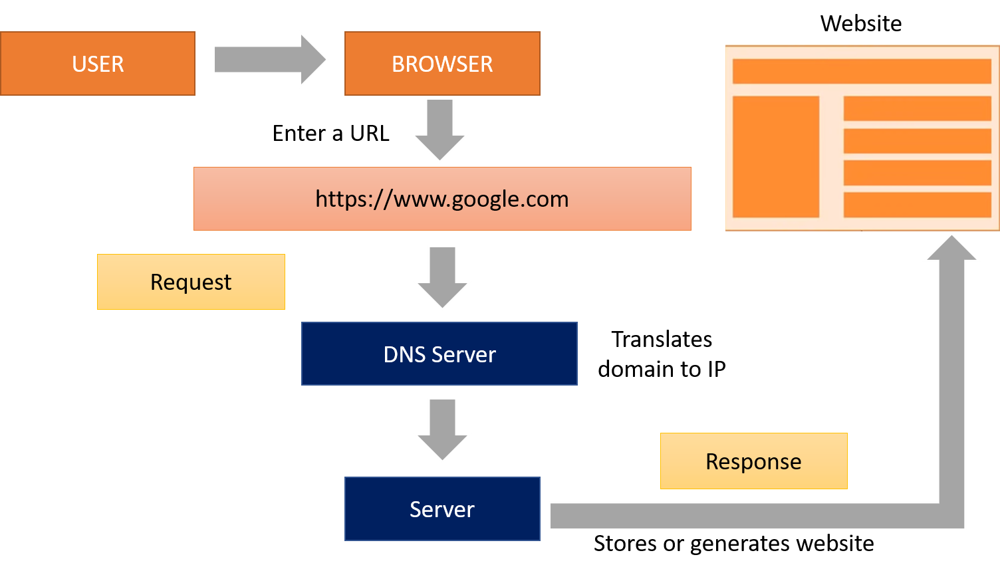

Excercise 1.1

When a user enters an URL in the browser, how does the browser fetch the desiredresult ? Explain this with the below in mind and Demonstrate this by drawing a diagram for the same.

a.What is the main functionality of the browser?
b.High Level Components of a browser.
c.Rendering engine and its use.
d.Parsers (HTML, CSS, etc)
e.Script Processors
f.Tree constructiong.Order of script processing
h.Layout and Painting

The browser's main functionality
The main function is to retrieve information from the World Wide Web and making it available for users.The information is generally an HTML document, PDF, image, or some other type of content.

The browser's high level structure
The main components of a Web Browser are:

**The user interface**: This includes the address bar, back/forward button, bookmarking menu, etc. Every part of the browser display except the window where you see the requested page is the user interface.

**The browser engine**: This is responsible to bring together the UI and the rendering engine.

**The rendering engine** : This is responsible for displaying the requested content. For example if the requested content is HTML, the rendering engine parses HTML and CSS, and displays the parsed content on the screen.

**Networking**: For network calls such as HTTP requests, using different implementations for different platform behind a platform-independent interface.

**UI backend**: This is used for drawing basic widgets like combo boxes and windows. This backend exposes a generic interface that is not platform specific. Underneath it uses operating system user interface methods.

**JavaScript interpreter**: Used to parse and execute JavaScript code.

**Data storage**: This is a persistence layer. The browser may need to save all sorts of data locally, such as cookies. Browsers also support storage mechanisms such as localStorage, IndexedDB, WebSQL and FileSystem.

The rendering engine
Different browsers use different rendering engines: Internet Explorer uses Trident, Firefox uses Gecko, Safari uses WebKit. Chrome and Opera (from version 15) use Blink, a fork of WebKit. 

The responsibility of the rendering engine is to display HTML and XML documents and images. It can display other types of data via plug-ins or extension; for example, displaying PDF documents using a PDF viewer plug-in. 

The rendering engine will start getting the contents of the requested document from the networking layer. 

After that the rendering engine will start parsing the HTML document and convert elements to DOM nodes in a tree called the *content tree*. The engine will parse the style data, both in external CSS files and in style elements. Styling information together with visual instructions in the HTML will be used to create another tree: the render tree.

The render tree contains rectangles with visual attributes like color and dimensions. The rectangles are in the right order to be displayed on the screen.

After the construction of the render tree it goes through a "layout" process. This means giving each node the exact coordinates where it should appear on the screen. The next stage is painting–the render tree will be traversed and each node will be painted using the UI backend layer.

For better user experience, the rendering engine will try to display contents on the screen as soon as possible. It will not wait until all HTML is parsed before starting to build and layout the render tree. 

